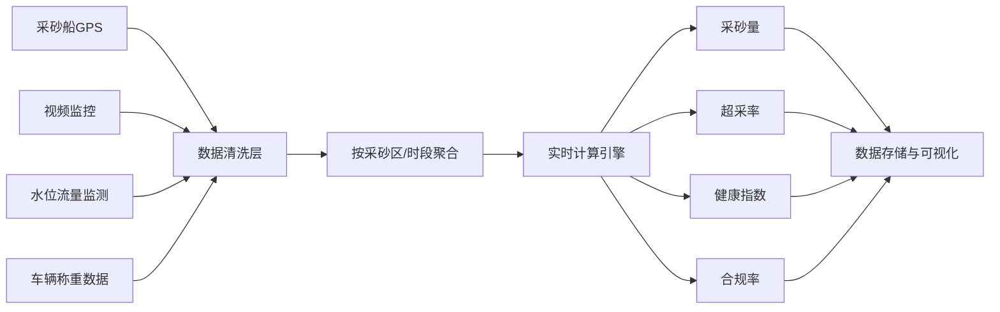
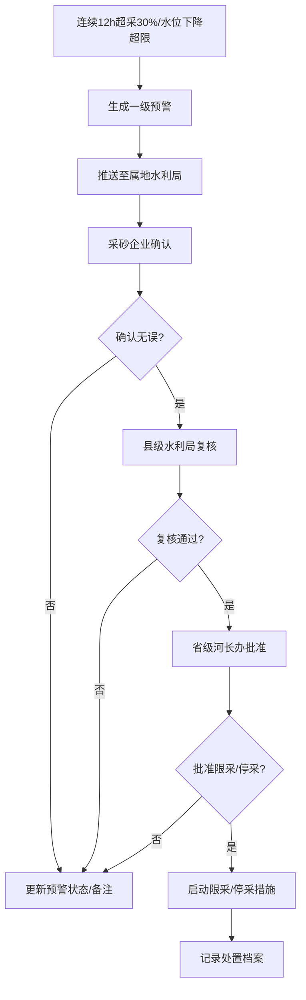
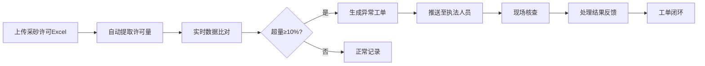

## 1. 产品概述
全国性河道采砂监管与河道健康智能分析平台，实现对全国各采砂区的实时监控、智能分析与预警处置。通过接入多源实时数据，自动计算采砂量、超采率、河道健康指数等关键指标，构建分级预警与审批机制，为各级水利部门提供精细化监管工具。

- **核心价值**：解决河道采砂监管数据分散、预警滞后、处置流程不规范等痛点，实现采砂全流程智能化监管
- **目标用户**：国家级水利部、省级河长办、市级/县级水利局、采砂企业、执法人员
- **市场定位**：政府行业监管平台，支撑全国河道采砂规范化管理与河道生态保护

## 2. 核心 Features

### 2.1 用户角色
| 角色 | 注册方法 | 核心权限 |
|------|----------|----------|
| 国家级管理员 | 系统预置 | 全国数据查看、全国报表生成、系统配置 |
| 省级管理员 | 管理员创建 | 所辖省份数据查看、省级审批、本省报表 |
| 市级管理员 | 管理员创建 | 所辖地市数据查看、市级复核、本市报表 |
| 县级管理员 | 管理员创建 | 所辖区县数据查看、县级复核、执法工单派发 |
| 采砂企业 | 管理员创建 | 采砂区数据查看、预警确认、许可申请 |
| 执法人员 | 管理员创建 | 异常工单处理、现场核查登记 |

### 2.2 功能模块
1. **首页看板**：全国采砂热力图、河道健康排名、关键指标概览、预警列表
2. **实时监控**：采砂船GPS轨迹、视频监控接入、水位流量监测、称重数据展示
3. **采砂区详情**：采砂区基本信息、近7天作业轨迹热力图、砂石运输流向占比、历史数据趋势
4. **预警管理**：预警列表、一级预警推送、三级审批流程（企业确认→县级复核→省级批准）、处置记录
5. **许可管理**：采砂许可Excel上传、自动提取许可量、实采与许可比对、异常工单生成
6. **统计报表**：采砂量同比环比分析、超采事件分布、河道淤积评估、周度健康诊断报告
7. **系统管理**：用户管理、权限配置、采砂区管理、阈值配置

### 2.3 页面详情
| 页面名称 | 模块名称 | 功能描述 |
|---------|----------|----------|
| 首页看板 | 数据概览模块 | 全国采砂量、超采率、健康指数、合规率等核心KPI展示 |
| 首页看板 | 全国采砂热力图 | 按省份聚合采砂数据，热力渲染展示，支持点击下钻 |
| 首页看板 | 河道健康排名 | 按健康指数降序排列，支持按省份筛选 |
| 首页看板 | 实时预警列表 | 展示最新预警信息，支持快速跳转处置 |
| 实时监控 | 采砂船轨迹监控 | 地图展示采砂船实时位置与轨迹回放 |
| 实时监控 | 视频监控墙 | 多画面展示采砂区视频监控 |
| 实时监控 | 水情监测 | 水位流量实时曲线与阈值告警 |
| 采砂区详情 | 基础信息卡 | 采砂区范围、许可量、作业时段等信息 |
| 采砂区详情 | 7天轨迹热力图 | 采砂船作业密度热力渲染 |
| 采砂区详情 | 运输流向占比 | 饼图展示砂石运输目的地分布 |
| 预警管理 | 预警列表 | 按级别、状态、时间筛选预警 |
| 预警管理 | 三级审批流程 | 可视化审批流，支持填写意见与附件上传 |
| 许可管理 | Excel上传 | 支持拖拽上传采砂许可Excel，自动解析 |
| 许可管理 | 许可比对 | 实采量与许可量实时比对，超量10%自动生成工单 |
| 统计报表 | 周度诊断报告 | 自动生成PDF报告，包含趋势分析与建议 |
| 系统管理 | 用户权限管理 | 三级权限体系，角色与菜单权限配置 |

## 3. 核心流程

### 3.1 数据采集处理流程

### 3.2 预警处置流程

### 3.3 许可比对与工单流程

## 4. 界面设计

### 4.1 设计风格
- **主色调**：深海蓝 #1e3a5f（代表水与河流）
- **辅助色**：警示红 #e53e3e（预警）、成功绿 #38a169（正常）、警戒橙 #dd6b20（注意）、信息青 #3182ce（数据）
- **中性色**：深灰 #2d3748、中灰 #4a5568、浅灰 #a0aec0、极浅灰 #edf2f7
- **按钮风格**：扁平化设计，圆角4px，悬停有轻微阴影与色阶变化
- **字体**：标题使用 Noto Serif SC（衬线体，体现政府平台庄重感），正文使用 Noto Sans SC（无衬线体，保证可读性）
- **布局风格**：卡片式布局，顶部导航+左侧菜单+主内容区的经典管理后台布局
- **图标风格**：线性图标，使用 Lucide Icons，保持简洁专业

### 4.2 页面设计概览
| 页面名称 | 模块名称 | UI元素 |
|---------|----------|--------|
| 首页看板 | 数据概览 | 渐变背景卡片，数字带动画效果，指标趋势迷你图 |
| 首页看板 | 热力图 | 全国地图分层设色，悬浮显示省份详情，点击下钻 |
| 首页看板 | 健康排名 | 排名列表，进度条可视化健康指数，前三名金色高亮 |
| 实时监控 | 地图监控 | 全屏地图，采砂船图标动画，轨迹动态绘制 |
| 实时监控 | 视频墙 | 网格化视频布局，支持单画面放大 |
| 预警管理 | 预警卡片 | 按级别彩色边框，倒计时标识待处理时长 |
| 预警管理 | 审批流程 | 时间线可视化审批节点，当前节点高亮 |
| 采砂区详情 | 轨迹热力 | 渐变热力渲染，时间轴滑块支持逐天查看 |
| 统计报表 | 报告预览 | 类PDF文档版式，支持图表交互 |

### 4.3 响应式设计
- **桌面端优先**：最小支持1280px宽度，推荐1920px及以上
- **平板适配**：左侧菜单可折叠，卡片布局自适应换行
- **移动适配**：简化为底部导航，核心数据卡片单列展示，地图与图表支持手势操作
- **触摸优化**：按钮最小尺寸44x44px，列表项间距适当加大

### 4.4 数据可视化指导
- **地图组件**：使用 ECharts 地图，支持省市区三级下钻，热力图采用蓝→绿→黄→红的渐变色带
- **图表组件**：使用 ECharts，折线图展示趋势，柱状图对比数据，饼图/玫瑰图展示占比
- **实时数据**：WebSocket 推送，数据刷新时平滑过渡动画，新数据高亮提示
- **预警闪烁**：一级预警采用呼吸灯动画效果，红色边框脉冲闪烁
