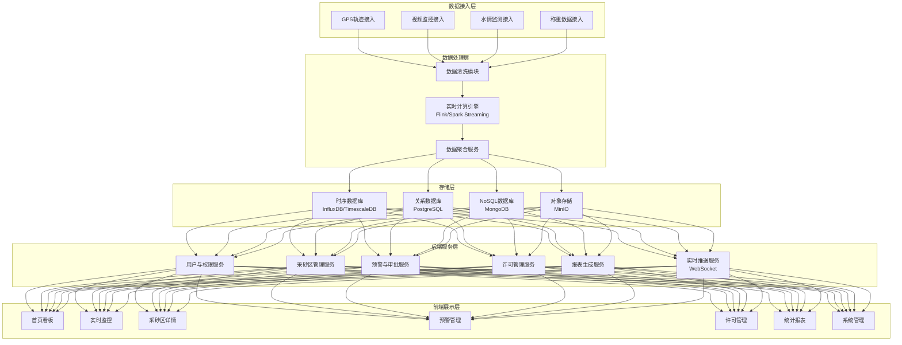

## 1. 架构设计



## 2. 技术选型

### 2.1 前端技术栈
- **框架**: React 18 + TypeScript
- **构建工具**: Vite 5.x
- **样式方案**: Tailwind CSS 3.x
- **状态管理**: Redux Toolkit + RTK Query
- **路由**: React Router v6
- **UI组件库**: Ant Design 5.x（定制化主题）
- **地图组件**: ECharts 5.x（地图）+ Leaflet（GIS地图）
- **图表组件**: ECharts 5.x
- **Excel处理**: SheetJS (xlsx)
- **日期处理**: Day.js
- **图标**: Lucide React
- **HTTP客户端**: Axios
- **WebSocket**: Socket.io-client

### 2.2 后端技术栈（可选，本期Mock数据）
- **框架**: Node.js + Express / NestJS
- **实时计算**: 模拟实现，前端定时刷新
- **认证授权**: JWT + RBAC
- **数据校验**: Zod / Class Validator

### 2.3 数据库（本期使用Mock数据）
- **关系型**: PostgreSQL（存储业务数据）
- **时序库**: TimescaleDB（存储监测时序数据）
- **文档库**: MongoDB（存储视频元数据、审批附件）

### 2.4 前端工程化
- **代码规范**: ESLint + Prettier
- **Git Hooks**: Husky + lint-staged
- **提交规范**: Commitlint
- **类型检查**: TypeScript Strict Mode

## 3. 路由定义

| 路由路径 | 页面名称 | 权限要求 | 说明 |
|---------|----------|----------|------|
| /login | 登录页 | 公开 | 用户登录入口 |
| /dashboard | 首页看板 | 登录用户 | 全国采砂热力图、健康排名、核心指标 |
| /monitor | 实时监控 | 登录用户 | 采砂船轨迹、视频监控、水情监测 |
| /monitor/ship/:id | 采砂船详情 | 登录用户 | 单船轨迹回放、作业数据 |
| /mining-area | 采砂区列表 | 登录用户 | 采砂区列表查询、筛选 |
| /mining-area/:id | 采砂区详情 | 登录用户 | 基础信息、轨迹热力图、运输流向 |
| /warning | 预警列表 | 登录用户 | 预警查询、状态筛选 |
| /warning/:id | 预警详情 | 相关角色 | 预警信息、三级审批流程 |
| /permit | 许可管理 | 管理用户 | 许可列表、Excel上传 |
| /permit/:id | 许可详情 | 管理用户 | 许可信息、比对数据、工单记录 |
| /work-order | 工单管理 | 执法人员 | 异常工单列表、处理 |
| /reports | 统计报表 | 登录用户 | 各类统计分析报表 |
| /reports/weekly | 周度诊断报告 | 登录用户 | 自动生成的周度报告 |
| /system/users | 用户管理 | 管理员 | 用户增删改查、权限配置 |
| /system/roles | 角色管理 | 管理员 | 角色定义、权限分配 |
| /system/areas | 采砂区配置 | 管理员 | 采砂区基础信息维护 |
| /system/thresholds | 阈值配置 | 管理员 | 预警阈值、参数配置 |
| /profile | 个人中心 | 登录用户 | 个人信息修改、密码修改 |

## 4. 权限体系

### 4.1 三级权限数据隔离
```typescript
// 数据权限级别
enum DataScope {
  NATIONAL = 'national',    // 国家级：全国数据
  PROVINCIAL = 'provincial', // 省级：本省数据
  MUNICIPAL = 'municipal',   // 市级：本市数据
  COUNTY = 'county',         // 县级：本县数据
  ENTERPRISE = 'enterprise', // 企业：仅本企业数据
  LAW_ENFORCEMENT = 'law_enforcement' // 执法：管辖区域
}

// 菜单权限
interface MenuPermission {
  menuId: string;
  canView: boolean;
  canEdit: boolean;
  canDelete: boolean;
  canApprove: boolean;
}

// 用户上下文
interface UserContext {
  userId: string;
  username: string;
  role: string;
  dataScope: DataScope;
  regionCode: string; // 行政区划编码
  permissions: MenuPermission[];
}
```

### 4.2 API接口规范
```typescript
// 通用响应结构
interface ApiResponse<T> {
  code: number;
  message: string;
  data: T;
  timestamp: number;
}

// 分页响应
interface PageResponse<T> {
  list: T[];
  total: number;
  page: number;
  pageSize: number;
}

// 核心指标接口
interface DashboardMetrics {
  totalSandMining: number;      // 全国今日采砂量(万吨)
  overMiningRate: number;       // 超采率(%)
  healthIndex: number;          // 河道健康指数(0-100)
  complianceRate: number;       // 运输合规率(%)
  activeWarningCount: number;   // 活跃预警数
  pendingApprovalCount: number; // 待审批数
}

// 采砂区数据接口
interface MiningArea {
  id: string;
  name: string;
  province: string;
  city: string;
  county: string;
  region: [number, number][];   // 边界坐标
  permittedAmount: number;      // 许可采砂量(万吨/年)
  actualAmount: number;         // 实际采砂量(万吨)
  overMiningRate: number;       // 超采率
  healthIndex: number;          // 健康指数
  status: 'normal' | 'warning' | 'suspended';
  ships: MiningShip[];
}

// 采砂船接口
interface MiningShip {
  id: string;
  name: string;
  mmsi: string;
  areaId: string;
  currentLocation: [number, number];
  currentStatus: 'mining' | 'transporting' | 'idle';
  todayOutput: number;
  trajectory: TrajectoryPoint[];
}

// 轨迹点
interface TrajectoryPoint {
  timestamp: number;
  location: [number, number];
  speed: number;
  heading: number;
  status: string;
}

// 预警接口
interface Warning {
  id: string;
  type: 'over_mining' | 'water_level_drop' | 'permit_exceed';
  level: 1 | 2 | 3;
  areaId: string;
  areaName: string;
  description: string;
  triggerTime: number;
  status: 'pending' | 'confirmed' | 'reviewed' | 'approved' | 'rejected' | 'closed';
  approvalFlow: ApprovalNode[];
  currentNode: number;
}

// 审批节点
interface ApprovalNode {
  id: string;
  nodeName: string;
  role: string;
  status: 'pending' | 'approved' | 'rejected';
  operator: string;
  operateTime: number;
  opinion: string;
  attachments: string[];
}

// 采砂许可接口
interface MiningPermit {
  id: string;
  permitNo: string;
  areaId: string;
  enterprise: string;
  permittedAmount: number;
  validFrom: string;
  validTo: string;
  actualAmount: number;
  exceedRate: number;
  status: 'valid' | 'exceeded' | 'expired';
  workOrders: WorkOrder[];
}

// 工单接口
interface WorkOrder {
  id: string;
  permitId: string;
  areaId: string;
  type: string;
  description: string;
  status: 'pending' | 'processing' | 'closed';
  assignee: string;
  createTime: number;
  handleTime: number;
  handleResult: string;
}
```

## 5. 数据模型设计

### 5.1 ER图
```mermaid
erDiagram
    "用户" ||--o{ "角色" : "属于"
    "角色" ||--o{ "权限" : "拥有"
    "用户" o--o{ "行政区划" : "管辖"
    
    "行政区划" ||--o{ "采砂区" : "包含"
    "采砂区" ||--o{ "采砂船" : "拥有"
    "采砂区" ||--o{ "采砂许可" : "关联"
    "采砂区" ||--o{ "预警" : "产生"
    "采砂区" ||--o{ "水情监测数据" : "产生"
    
    "采砂船" ||--o{ "GPS轨迹" : "产生"
    "采砂船" ||--o{ "作业记录" : "产生"
    
    "采砂许可" ||--o{ "异常工单" : "触发"
    "异常工单" ||--|| "用户" : "指派"
    
    "预警" ||--o{ "审批节点" : "包含"
    "审批节点" ||--|| "用户" : "处理"
    
    "运输车辆" ||--o{ "称重记录" : "产生"
    "采砂区" ||--o{ "运输车辆" : "关联"
    
    "周度报告" }o--|| "采砂区" : "分析"
```

### 5.2 核心表结构DDL

```sql
-- 用户表
CREATE TABLE sys_user (
  id VARCHAR(32) PRIMARY KEY,
  username VARCHAR(50) NOT NULL UNIQUE,
  password VARCHAR(100) NOT NULL,
  real_name VARCHAR(50),
  phone VARCHAR(20),
  email VARCHAR(100),
  role_id VARCHAR(32),
  region_code VARCHAR(12),
  data_scope VARCHAR(20) NOT NULL,
  status TINYINT DEFAULT 1,
  created_at TIMESTAMP DEFAULT CURRENT_TIMESTAMP,
  updated_at TIMESTAMP DEFAULT CURRENT_TIMESTAMP ON UPDATE CURRENT_TIMESTAMP,
  INDEX idx_username (username),
  INDEX idx_region (region_code)
);

-- 角色表
CREATE TABLE sys_role (
  id VARCHAR(32) PRIMARY KEY,
  name VARCHAR(50) NOT NULL,
  code VARCHAR(50) NOT NULL UNIQUE,
  description VARCHAR(200),
  permissions JSON,
  status TINYINT DEFAULT 1,
  created_at TIMESTAMP DEFAULT CURRENT_TIMESTAMP
);

-- 行政区划表
CREATE TABLE sys_region (
  code VARCHAR(12) PRIMARY KEY,
  name VARCHAR(100) NOT NULL,
  parent_code VARCHAR(12),
  level TINYINT,
  center_lng DECIMAL(10,7),
  center_lat DECIMAL(10,7),
  INDEX idx_parent (parent_code)
);

-- 采砂区表
CREATE TABLE mining_area (
  id VARCHAR(32) PRIMARY KEY,
  name VARCHAR(100) NOT NULL,
  region_code VARCHAR(12) NOT NULL,
  boundary POLYGON,
  permitted_amount DECIMAL(15,2) COMMENT '年许可采砂量(万吨)',
  current_actual DECIMAL(15,2) COMMENT '本年实际采砂量',
  health_index DECIMAL(5,2),
  status VARCHAR(20) DEFAULT 'normal',
  created_at TIMESTAMP DEFAULT CURRENT_TIMESTAMP,
  INDEX idx_region (region_code),
  INDEX idx_status (status)
);

-- 采砂船表
CREATE TABLE mining_ship (
  id VARCHAR(32) PRIMARY KEY,
  name VARCHAR(50) NOT NULL,
  mmsi VARCHAR(15) UNIQUE,
  area_id VARCHAR(32) NOT NULL,
  enterprise VARCHAR(100),
  current_lng DECIMAL(10,7),
  current_lat DECIMAL(10,7),
  current_status VARCHAR(20),
  today_output DECIMAL(10,2),
  last_update TIMESTAMP,
  INDEX idx_area (area_id),
  INDEX idx_mmsi (mmsi)
);

-- GPS轨迹表（时序表）
CREATE TABLE ship_trajectory (
  id BIGINT AUTO_INCREMENT PRIMARY KEY,
  ship_id VARCHAR(32) NOT NULL,
  timestamp TIMESTAMP NOT NULL,
  lng DECIMAL(10,7) NOT NULL,
  lat DECIMAL(10,7) NOT NULL,
  speed DECIMAL(6,2),
  heading DECIMAL(5,2),
  status VARCHAR(20),
  INDEX idx_ship_time (ship_id, timestamp DESC)
);

-- 预警表
CREATE TABLE warning (
  id VARCHAR(32) PRIMARY KEY,
  type VARCHAR(30) NOT NULL,
  level TINYINT NOT NULL,
  area_id VARCHAR(32) NOT NULL,
  description TEXT,
  trigger_time TIMESTAMP NOT NULL,
  status VARCHAR(20) DEFAULT 'pending',
  current_node INT DEFAULT 0,
  created_at TIMESTAMP DEFAULT CURRENT_TIMESTAMP,
  INDEX idx_area (area_id),
  INDEX idx_status (status),
  INDEX idx_time (trigger_time DESC)
);

-- 审批节点表
CREATE TABLE approval_node (
  id VARCHAR(32) PRIMARY KEY,
  warning_id VARCHAR(32) NOT NULL,
  node_index INT NOT NULL,
  node_name VARCHAR(50) NOT NULL,
  require_role VARCHAR(30) NOT NULL,
  status VARCHAR(20) DEFAULT 'pending',
  operator_id VARCHAR(32),
  operate_time TIMESTAMP,
  opinion TEXT,
  attachments JSON,
  INDEX idx_warning (warning_id)
);

-- 采砂许可表
CREATE TABLE mining_permit (
  id VARCHAR(32) PRIMARY KEY,
  permit_no VARCHAR(50) UNIQUE NOT NULL,
  area_id VARCHAR(32) NOT NULL,
  enterprise VARCHAR(100) NOT NULL,
  permitted_amount DECIMAL(15,2) NOT NULL,
  valid_from DATE NOT NULL,
  valid_to DATE NOT NULL,
  actual_amount DECIMAL(15,2) DEFAULT 0,
  exceed_rate DECIMAL(5,2) DEFAULT 0,
  status VARCHAR(20) DEFAULT 'valid',
  created_at TIMESTAMP DEFAULT CURRENT_TIMESTAMP,
  INDEX idx_area (area_id),
  INDEX idx_status (status)
);

-- 异常工单表
CREATE TABLE work_order (
  id VARCHAR(32) PRIMARY KEY,
  permit_id VARCHAR(32),
  area_id VARCHAR(32) NOT NULL,
  type VARCHAR(30) NOT NULL,
  description TEXT,
  status VARCHAR(20) DEFAULT 'pending',
  assignee_id VARCHAR(32),
  handle_result TEXT,
  create_time TIMESTAMP DEFAULT CURRENT_TIMESTAMP,
  handle_time TIMESTAMP,
  INDEX idx_status (status),
  INDEX idx_assignee (assignee_id)
);

-- 水情监测数据表（时序表）
CREATE TABLE water_monitor (
  id BIGINT AUTO_INCREMENT PRIMARY KEY,
  area_id VARCHAR(32) NOT NULL,
  timestamp TIMESTAMP NOT NULL,
  water_level DECIMAL(8,3) COMMENT '水位(m)',
  flow_rate DECIMAL(10,3) COMMENT '流量(m³/s)',
  drop_rate DECIMAL(6,3) COMMENT '水位下降速率(m/h)',
  INDEX idx_area_time (area_id, timestamp DESC)
);

-- 称重记录表
CREATE TABLE weighing_record (
  id VARCHAR(32) PRIMARY KEY,
  vehicle_no VARCHAR(20) NOT NULL,
  area_id VARCHAR(32) NOT NULL,
  weight DECIMAL(8,2) NOT NULL,
  destination VARCHAR(100),
  weigh_time TIMESTAMP NOT NULL,
  is_compliant TINYINT DEFAULT 1,
  INDEX idx_area_time (area_id, weigh_time DESC),
  INDEX idx_vehicle (vehicle_no)
);

-- 周度诊断报告表
CREATE TABLE weekly_report (
  id VARCHAR(32) PRIMARY KEY,
  area_id VARCHAR(32),
  report_date DATE NOT NULL,
  sand_mining_amount DECIMAL(15,2),
  sand_mining_yoy DECIMAL(5,2),
  sand_mining_mom DECIMAL(5,2),
  over_mining_events INT,
  health_index DECIMAL(5,2),
  siltation_assessment TEXT,
  recommendations TEXT,
  created_at TIMESTAMP DEFAULT CURRENT_TIMESTAMP,
  INDEX idx_area_date (area_id, report_date DESC)
);
```

## 6. 核心算法与业务逻辑

### 6.1 采砂量实时计算
```typescript
/**
 * 计算指定采砂区在指定时段内的采砂量
 * @param areaId 采砂区ID
 * @param startTime 开始时间
 * @param endTime 结束时间
 */
function calculateSandMiningAmount(
  areaId: string,
  startTime: number,
  endTime: number
): number {
  // 1. 归集该时段内所有采砂船的作业轨迹
  const trajectories = getShipTrajectoriesByArea(areaId, startTime, endTime);
  
  // 2. 识别有效采砂作业段（基于速度、位置、作业状态）
  const miningSegments = identifyMiningSegments(trajectories);
  
  // 3. 结合称重数据校准
  const weighingRecords = getWeighingRecords(areaId, startTime, endTime);
  
  // 4. 计算总采砂量 = 作业时间 * 单位时间采砂效率 + 称重修正系数
  let totalAmount = 0;
  for (const segment of miningSegments) {
    const durationHours = (segment.endTime - segment.startTime) / 3600000;
    const shipEfficiency = getShipEfficiency(segment.shipId);
    totalAmount += durationHours * shipEfficiency;
  }
  
  // 5. 应用称重数据修正系数
  if (weighingRecords.length > 0) {
    const totalWeighed = weighingRecords.reduce((sum, r) => sum + r.weight, 0);
    const correctionFactor = totalWeighed / totalAmount;
    totalAmount = totalAmount * correctionFactor;
  }
  
  return Math.round(totalAmount * 100) / 100;
}
```

### 6.2 超采率计算
```typescript
/**
 * 计算超采率
 * @param actualAmount 实际采砂量
 * @param permittedAmount 许可采砂量
 */
function calculateOverMiningRate(actualAmount: number, permittedAmount: number): number {
  if (permittedAmount <= 0) return 0;
  const rate = ((actualAmount - permittedAmount) / permittedAmount) * 100;
  return Math.max(0, Math.round(rate * 100) / 100);
}

/**
 * 检测连续12小时超采30%
 * @param areaId 采砂区ID
 */
function detectContinuousOverMining(areaId: string): boolean {
  const now = Date.now();
  const twelveHoursAgo = now - 12 * 3600 * 100;
  
  // 获取过去12小时每小时的采砂量
  const hourlyAmounts = getHourlyMiningAmounts(areaId, twelveHoursAgo, now);
  const permittedHourly = getPermittedHourlyAmount(areaId);
  
  // 检查是否连续12小时超采30%
  return hourlyAmounts.every(amount => {
    const rate = calculateOverMiningRate(amount, permittedHourly);
    return rate >= 30;
  });
}
```

### 6.3 河道健康指数计算
```typescript
/**
 * 计算河道健康综合指数(0-100)
 * @param areaId 采砂区ID
 */
function calculateHealthIndex(areaId: string): number {
  // 指标权重
  const weights = {
    overMining: 0.35,      // 超采情况 35%
    waterLevelStability: 0.25, // 水位稳定性 25%
    siltationStatus: 0.2,  // 淤积情况 20%
    ecologicalImpact: 0.2  // 生态影响 20%
  };
  
  // 1. 超采评分 (0-100，超采率越高分数越低)
  const overMiningRate = getCurrentOverMiningRate(areaId);
  const overMiningScore = Math.max(0, 100 - overMiningRate * 2);
  
  // 2. 水位稳定性评分 (0-100，波动越小分数越高)
  const waterFluctuation = getWaterLevelFluctuation(areaId);
  const waterLevelScore = Math.max(0, 100 - waterFluctuation * 50);
  
  // 3. 淤积情况评分 (0-100)
  const siltationLevel = getSiltationAssessment(areaId);
  const siltationScore = 100 - siltationLevel * 25;
  
  // 4. 生态影响评分 (基于保护区距离、作业时段等)
  const ecologicalScore = calculateEcologicalScore(areaId);
  
  // 加权求和
  const healthIndex = 
    overMiningScore * weights.overMining +
    waterLevelScore * weights.waterLevelStability +
    siltationScore * weights.siltationStatus +
    ecologicalScore * weights.ecologicalImpact;
  
  return Math.round(healthIndex * 10) / 10;
}
```

### 6.4 运输车辆合规率计算
```typescript
/**
 * 计算运输车辆合规率
 * @param areaId 采砂区ID
 * @param period 统计时段
 */
function calculateComplianceRate(areaId: string, period: 'day' | 'week' | 'month'): number {
  const records = getWeighingRecordsByPeriod(areaId, period);
  if (records.length === 0) return 100;
  
  const compliantCount = records.filter(r => r.isCompliant).length;
  return Math.round((compliantCount / records.length) * 100 * 10) / 10;
}
```

### 6.5 水位下降速率检测
```typescript
/**
 * 检测水位下降速率是否超限
 * @param areaId 采砂区ID
 * @param threshold 阈值(m/h)，默认0.5m/h
 */
function detectWaterLevelDrop(areaId: string, threshold: number = 0.5): boolean {
  const recentData = getRecentWaterMonitorData(areaId, 4); // 最近4小时数据
  
  if (recentData.length < 2) return false;
  
  // 计算下降速率
  const firstRecord = recentData[0];
  const lastRecord = recentData[recentData.length - 1];
  const hoursDiff = (lastRecord.timestamp - firstRecord.timestamp) / 3600000;
  const dropRate = (firstRecord.waterLevel - lastRecord.waterLevel) / hoursDiff;
  
  return dropRate > threshold;
}
```

## 7. 前端项目结构

```
src/
├── assets/              # 静态资源
│   ├── fonts/          # 字体文件
│   ├── images/         # 图片资源
│   └── styles/         # 全局样式
├── components/          # 通用组件
│   ├── layout/         # 布局组件
│   ├── charts/         # 图表组件
│   ├── map/            # 地图组件
│   ├── table/          # 表格组件
│   └── common/         # 通用UI组件
├── pages/              # 页面组件
│   ├── dashboard/      # 首页看板
│   ├── monitor/        # 实时监控
│   ├── mining-area/    # 采砂区管理
│   ├── warning/        # 预警管理
│   ├── permit/         # 许可管理
│   ├── work-order/     # 工单管理
│   ├── reports/        # 统计报表
│   └── system/         # 系统管理
├── services/           # API服务
│   ├── api.ts          # API封装
│   ├── dashboard.ts    # 看板相关接口
│   ├── monitor.ts      # 监控相关接口
│   ├── warning.ts      # 预警相关接口
│   └── ...
├── store/              # 状态管理
│   ├── slices/         # Redux slices
│   │   ├── user.ts     # 用户状态
│   │   ├── warning.ts  # 预警状态
│   │   └── ...
│   └── index.ts        # Store配置
├── hooks/              # 自定义Hooks
│   ├── useWebSocket.ts # WebSocket Hook
│   ├── usePermission.ts # 权限Hook
│   └── useMap.ts       # 地图Hook
├── utils/              # 工具函数
│   ├── auth.ts         # 认证相关
│   ├── permission.ts   # 权限检查
│   ├── format.ts       # 格式化工具
│   └── calculation.ts  # 计算工具
├── types/              # TypeScript类型定义
│   ├── api.ts          # API类型
│   ├── business.ts     # 业务类型
│   └── common.ts       # 通用类型
├── mock/               # Mock数据
│   ├── data/           # Mock数据文件
│   └── handlers.ts     # Mock处理函数
├── router/             # 路由配置
│   ├── index.tsx       # 路由入口
│   └── routes.ts       # 路由定义
├── App.tsx             # 根组件
├── main.tsx            # 入口文件
└── vite-env.d.ts       # Vite类型定义
```

## 8. Mock数据策略

### 8.1 数据生成原则
- **真实性**：模拟真实地理数据、合理的采砂量范围
- **多样性**：覆盖不同省份、不同规模的采砂区
- **动态性**：支持实时数据模拟，每分钟更新
- **异常场景**：预置超采预警、水位异常等场景

### 8.2 Mock数据范围
- 全国34个省级行政区，每个省3-5个采砂区
- 每个采砂区5-10艘采砂船
- 模拟过去7天的轨迹数据
- 模拟过去30天的采砂量数据
- 预置5-8条活跃预警数据
- 预置10-15份采砂许可数据

### 8.3 实时数据模拟
- 使用 `setInterval` 模拟实时数据推送
- WebSocket 连接模拟，每30秒推送一次采砂船位置更新
- 每分钟更新一次核心指标数据
- 随机触发预警场景（用于演示）
